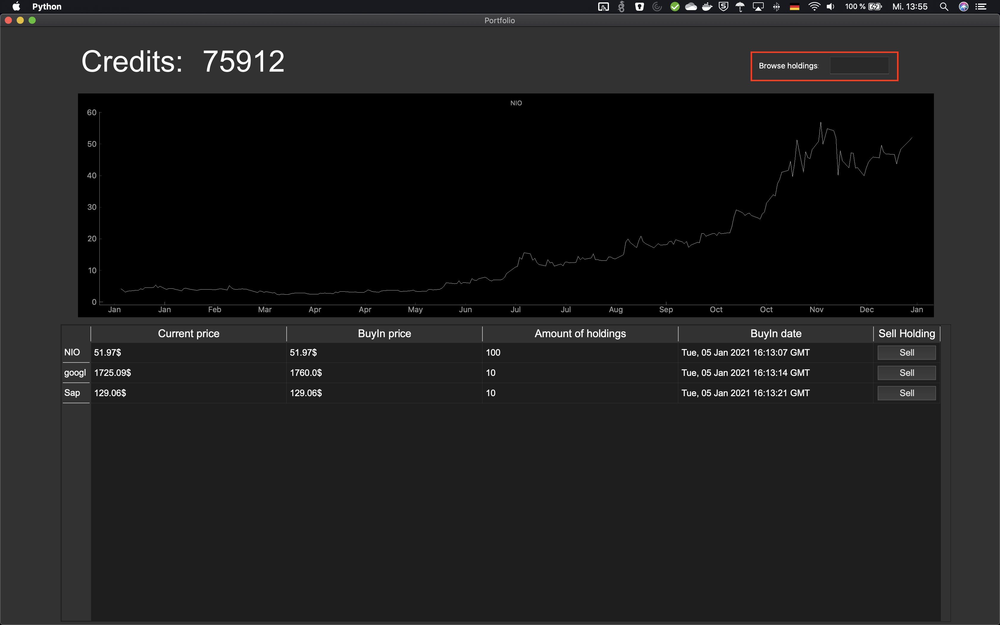

# Portfolio Manager

Mithilfe von Spielgeld können Aktien gekauft,
verwaltet und schließlich verkauft werden.
Alle Aktien lassen sich außerdem als Graph darstellen.

## Installation

Vorausgesetzt ist eine aktuelle Python 3 Version. 
Die Librarys können wie folgt installiert werden:
~~~~bash
pip install -m requirements.txt
~~~~

### Dependencys
Bei dem hier vorliegenden Repository handelt es sich um das Frontend des Programmes. 
Als Backend läuft eine Rest-API auf einem Heroku Server. Diese kommuniziert mit einer MySQL Datenbank.

## Bedienung

Wird das Programm erstmalig geöffnet, erscheint eine Registerkarte. 
Hier muss sich der Nutzer mit einem Username sowie Passwort registrieren. Die Eingabe kann mithilfe der Enter Taste bestätigt werden.
Die Login-Daten haben später für den Nutzer keine weitere Bedeutung.

Nach der Registrierung öffnet sich nun das Hauptfenster.
Hier befindet sich eine Tabelle mit allen Aktien des Nutzers, sowie einem Graph, welcher eine ausgewählte Aktie anzeigt.
Die dargestellte Aktie kann durch Anklicken einer Aktie in der Tabelle geändert werden.
Mithilfe des „Sell“-Knopfes öffnet sich ein Frage-Dialog. Hier kann die Anzahl der zu verkaufenden Aktien gewählt und anschließend bestätigt werden.

In der oberen rechten Ecke befindet sich ein Textfeld. Durch Eingabe und bestätigen mittels der Enter-Taste, wird nach einer neuen Aktie gesucht.

Daraufhin wird der Nutzer zu einer detaillierteren Ansicht dieser weitergeleitet. 
Sie kann nun über den „Buy“-Knopf gekauft werden, wobei zuerst wieder die Anzahl ausgewählt werden muss.

Neue Aktien lassen sich durch erneutes Eingeben im Textfeld suchen. 

Mithilfe der „Back to Portfolio“-Taste gelangt der Nutzer zurück zu seinem Portfolio.

## Aufgabe der Python Files

### `controller.py`

Der Controller steuert das gesamte Programm und beinhaltet die Programmlogik

### `view.py`

Die View ist für die Darstellung der Daten zuständig.

### `model.py`

Das Model beinhaltet die Funktionen für die Datenbankabfragen.

### `hashcode_utils.py`

Hier befinden sich die Hilfsfunktionen für den Hashcode. 

### `holdings_data_utils.py`

Hier befinden sich die Hilfsfunktionen für die Abfragen der Aktiendaten.

### Frontend total lines of Code
853
### Backend total lines of Code
361