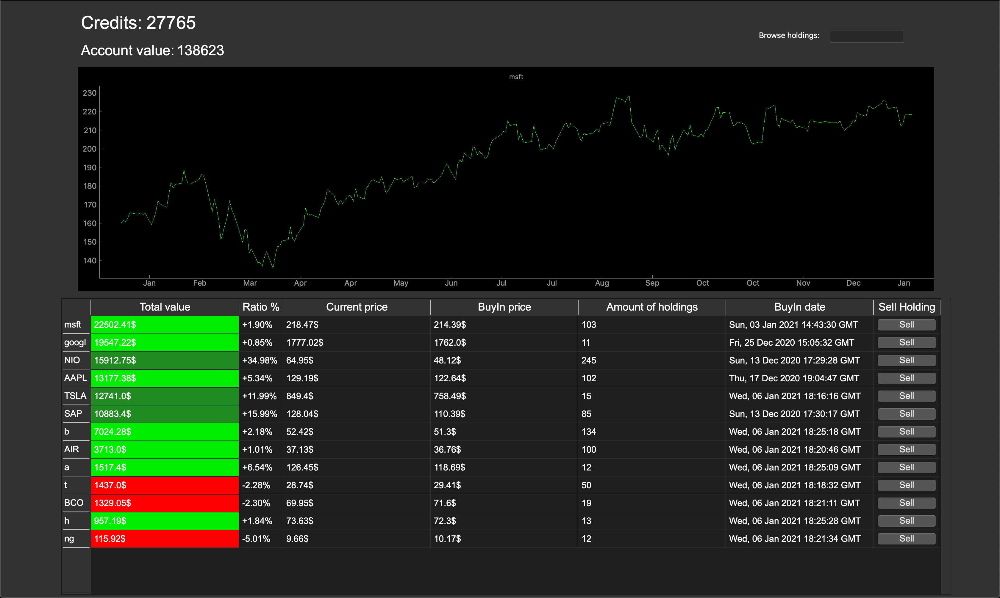

# Portfolio Manager

## Motivation and Goal

The application should provide the user a GUI, where he can buy, hold, and sell stocks, when logged in.
Therefore, it uses play money, so the user can play and test around.

## Installation

- Python 3 installed

### Dependencies

~~~~bash
pip install -m requirements.txt
~~~~

For security reasons the communication with the Database is capsuled into an extra Backend ([Repository](https://github.com/Pondo18/stock-portfolio-manager-backend)). For deployment please follow in the instructions provided in the Backend Repository.

## Implementation

The application follows the MVC-Model.

### `controller.py`

The controller controls the entire program and contains the program logic.
With the help of PyQt Signals, he gets triggered events from the view.
~~~~Python
    def init_me(self):
        self._register.enter_pressed.connect(self.do_register)
        self._main_gui.signal_table_clicked.connect(self.clicked_table)
        self._main_gui.signal_buy_holding.connect(self.buy_holding)
        self._main_gui.signal_sell_holding.connect(self.sell_holding)
        self._main_gui.signal_change_to_portfolio.connect(self.change_card_to_portfolio)
        self._main_gui.signal_change_to_browse_holdings.connect(self.change_card_to_browse_holdings)
        self._main_gui.signal_browse_new_holding.connect(self.browse_new_holding)
        self._main_gui.signal_period_max.connect(self.change_period)
        self._main_gui.signal_period_year.connect(self.change_period)
        self._main_gui.signal_period_month.connect(self.change_period)
~~~~

### `view.py`

The view is responsible for displaying the data.
It was created using PyQt5 and pyqtgraph.
As usual for PyQt, it is also programmed in an object-oriented manner.
~~~~Python
def __init__(self, size):
~~~~
In the constructor, all object variables and widgets for the presentation are first created.
Adjustments to these then take place in the associated inits:
~~~~Python
init_portfolio
init_browse_holdings
init_table
~~~~
With the help of PyQt signals and events, it forwards user input to the controller, which then processes it.
~~~~Python
enter_pressed = pyqtSignal()
self.textbox_password.returnPressed.connect(self.enter_pressed)
~~~~
### `model.py`

The model holds the functionality for querying data from the Rest-API
~~~~Python
environment = os.environ.get('ENVIRON', 'development')
with open("config.yaml", "r") as yamlfile:
    self.cfg = yaml.load(yamlfile, Loader=yaml.FullLoader)

self.api_host = self.cfg[environment]['api_endpoint']
~~~~
The associated api_host is loaded from the config.yaml file. This can be switched between development on the server and local development as follows:
~~~~Bash
export ENVIRON=production
~~~~
or
~~~~Bash
export ENVIRON=development
~~~~
### `hashcode_utils.py`

Here all of the hashcode functionality is located
When logged in the hashcode gets saved into the `token.txt`.

### `holdings_data_utils.py`

This file is necessary for querying the stock data. Therefore, it uses the yfinance library.

## Credits

### Used sources 

- [yfinance-api](https://pypi.org/project/yfinance/)
